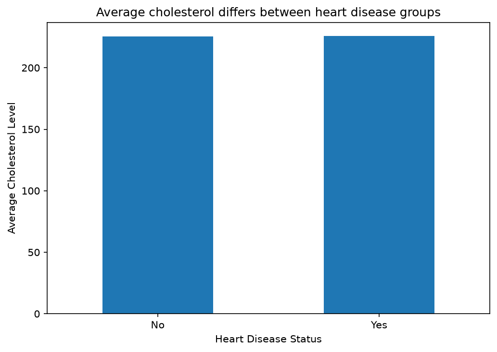
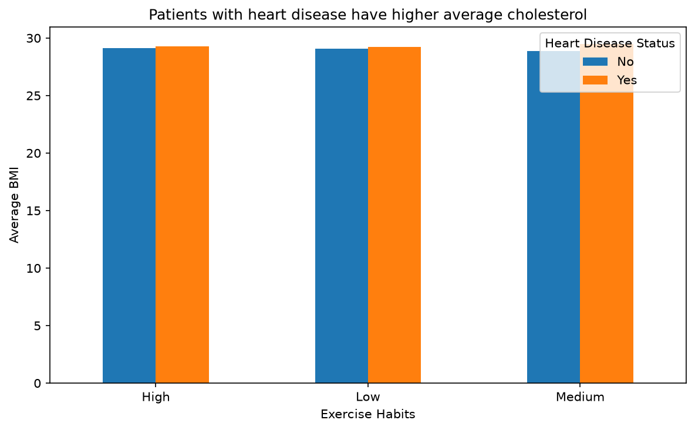

# Weekend Assignment 2: Heart Disease Dataset analysis

## 1. Question Explored

This analysis explores factors associated with heart disease status in the heart disease dataset. In particular, it examines differences in cholesterol levels across heart disease groups and the relationship between exercise habits, BMI, and heart disease status.

## 2. Data Cleaning

The dataset was inspected for missing values, data types, and duplicate records.

Most variables had very small amounts of missing data, generally between 0.19% and 0.30%. Alcohol Consumption had 25.86% missing values. Numerical missing values were replaced using the median, while categorical missing values were replaced using the mode. Alcohol Consumption was also imputed using the mode rather than deleting approximately 26% of the observations.

Categorical values were checked for consistency and no obvious inconsistent categories were found. Numerical variables were checked using the IQR method, and no outliers were identified.

## 3. Feature Engineering

A GroupBy transformation calculated mean age and mean cholesterol level for each gender. These statistics were merged back into the main dataframe.

A pivot table was also created to compare average BMI by exercise habits and heart disease status.

## 4. NumPy Computation

Cholesterol Level was converted into a NumPy array and standardized using a vectorized z-score calculation. The result was stored in the new Cholesterol_Z column.

## 5. Findings

The dataset contains 9,971 patient records. Heart disease status is approximately 80% No and 20% Yes.

The missing Alcohol Consumption group had a heart disease distribution similar to the full dataset, supporting the decision to retain the observations rather than delete them.

The actual findings from the two visualizations are based on the calculated results in the notebook.

### Figure 1

### Figure 2

## 6. Limitation

The analysis identifies associations in the dataset but does not prove that one factor causes heart disease. In addition, missing Alcohol Consumption values were replaced with the mode, which may not perfectly represent the original responses.

# Task 7: Reflection

## Question 1: Which transform took the longest to get right, and why?

The GroupBy and merge transformation took the longest because I needed to understand how to calculate statistics for each group and then merge those statistics back to the original dataframe without changing the number of patient records.

## Question 2 What would you do differently with another dataset?

With another dataset, I would first spend more time understanding the meaning and quality of each variable. I would investigate missing-value patterns before choosing an imputation method and compare different feature-engineering approaches to determine which ones provide the most useful information.
